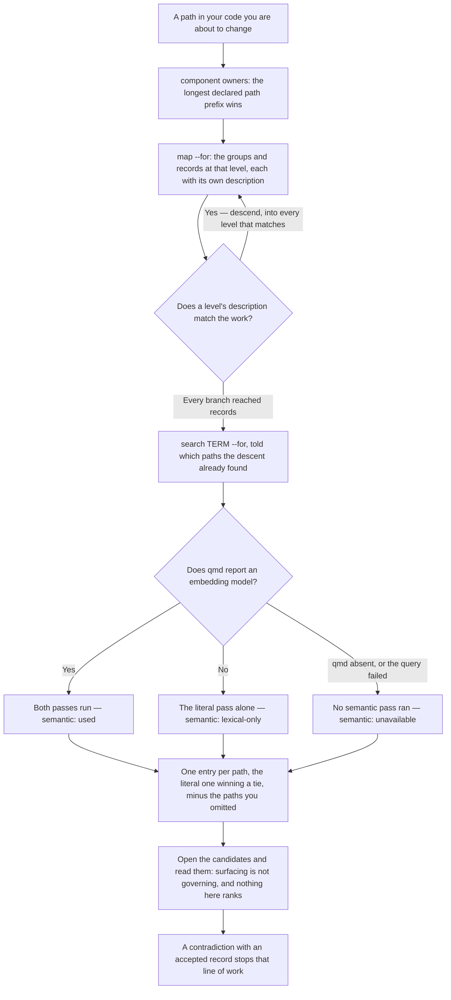
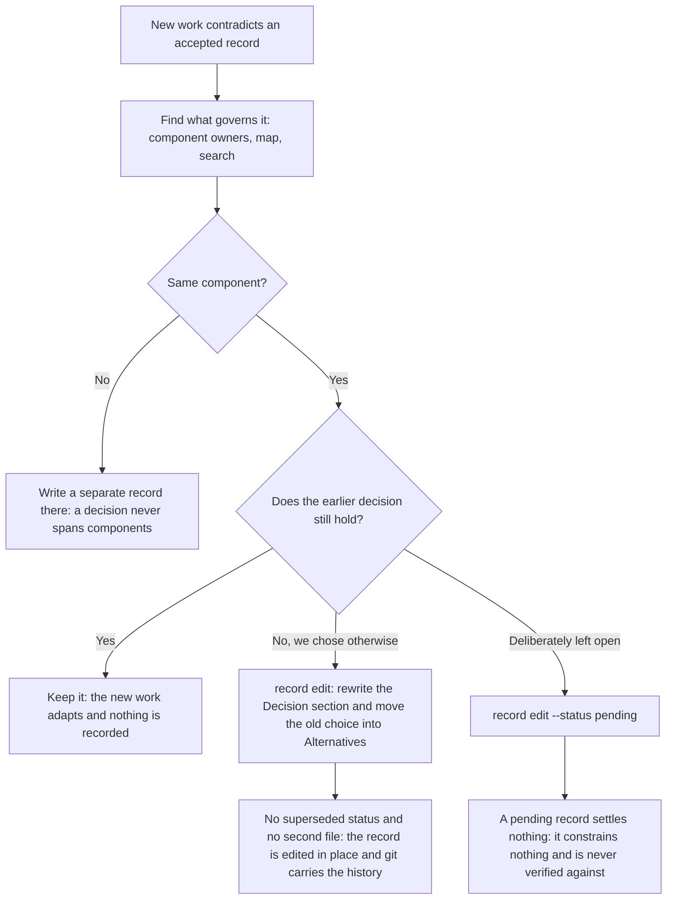
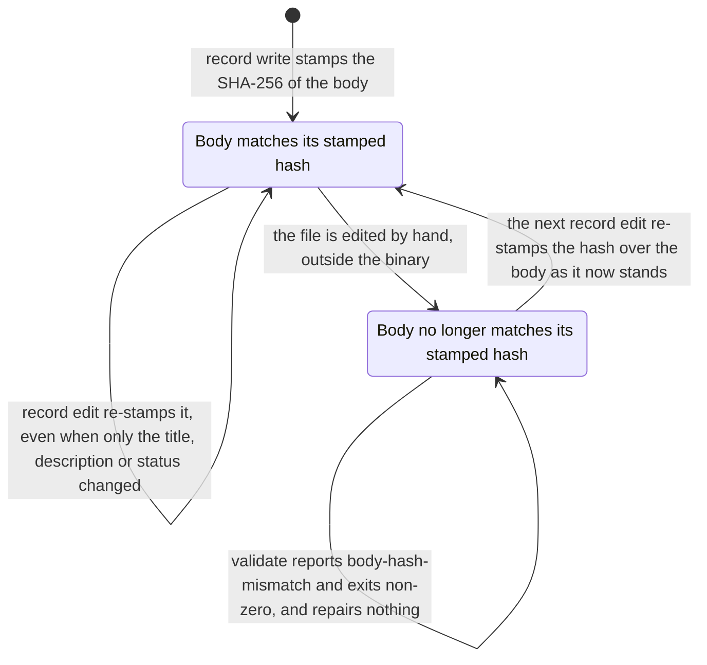

# openrecord

A project's durable records: **what was chosen and why**, and **what the system does**. A directory
layout, two kinds of document, and a CLI that reads and writes them.

It is not an agent framework and it never calls a model. Everything it does is deterministic;
everything that needs judgement is prose a person or an agent writes.

## Install

```bash
curl -fsSL https://raw.githubusercontent.com/franwerner/open-record/master/scripts/install.sh | bash
```

Installs to `~/.local/bin`. Set `INSTALL_DIR` to change that, or `VERSION=v0.1.0` to pin a release.

It asks once whether to install [qmd](https://github.com/franwerner/qmd) as well, for semantic search.
Answering no costs nothing — searches fall back to the deterministic steps and say so — and you can add
it later with `openrecord qmd install`. Set `WITH_QMD=yes` or `WITH_QMD=no` to answer in advance; an
install that is not attached to a terminal never asks and never blocks.

With a Go toolchain:

```bash
go install github.com/franwerner/openrecord/cmd/openrecord@latest
```

Or download an archive for your platform from
[Releases](https://github.com/franwerner/open-record/releases) and put the binary on your `PATH`.

## Use

```bash
# Declare a surface. The first one creates the store.
openrecord component add api --path src/api \
  --title "API" --description "The HTTP surface. Descend here if you touch endpoints."

# Find what governs the code you are about to change.
openrecord component owners src/api/handlers/user.go   # → api
openrecord map --for decisions/api                     # → its concerns, with descriptions
openrecord map --for decisions/api/security            # → subgroups and records

# Search: the literal pass, plus the meaning pass when qmd can answer.
openrecord search "rate limit" --for decisions/api

# Write. Nothing invalid ever lands: the checks run on the way in.
openrecord level add decisions/api/security
openrecord record write decisions/api/security/at-the-gateway.md \
  --title "Rate limiting at the gateway" \
  --description "Applied at the gateway, not in each handler." \
  --status accepted --body-file ./body.md

# Check, render, and hand the agent skills to your tool.
openrecord validate
openrecord diagram specs/flow/user-signup.md
openrecord skills --emit .claude/skills/
```

Every command returns JSON on stdout, because the first consumer is an agent. `diagram` is the one
exception — it emits raw Mermaid, so it can be piped.

## The store

```
.openrecord/
├── decisions/<component>/<concern>/[<subgroup>/]<record>.md
├── specs/<type>/[<subgroup>/]<capability>.md          flow | rule | lifecycle | process
└── components.json
```

Two rules generate most of that shape:

**A single-valued axis becomes a folder; a multi-valued axis becomes a property.** A decision governs
one surface, so the component is its folder. A capability crosses surfaces, so its components are a
frontmatter list — a signup that starts in the UI, passes through the API and can also be triggered
from the CLI is *one* capability, not three.

**Every level declares when to descend into it.** Each folder carries an `INDEX.md` holding only a
title and a description. It never lists what is inside: listing is generated from frontmatter, so
there is nothing to fall out of sync.

## Finding what governs a change

Three commands, in order, and only the middle one enumerates. `component owners` turns a path in your
code into the surface that governs it. `map` walks down from there a level at a time, and you steer it
by reading each level's description — descend into every one that matches the work, not the one that
matches best. `search` then runs the literal pass and, when the semantic tool can answer, the
meaning-based one too, in a single call; tell it what the descent already found and it leaves those out.



No search proves an absence. Coverage comes from reading the descriptions on the way down, never from
a query coming back empty — which is why the descent runs first and `search` is told what it found.
[docs/cli.md](docs/cli.md) documents every command in full.

## Handling contradictions

A decision that new work contradicts is never superseded — there is no such status. The record is
edited in place: the new choice replaces the old one, the old one moves into `## Alternatives`, and
git carries the history. Leaving the question open is `pending`, which settles nothing — a pending
record constrains nothing and is never verified against.



Every record carries a `body-hash`, the SHA-256 of its body, stamped by `record write` and re-stamped
by `record edit` on every edit — including one that only touches the title, description or status. A
file changed by hand keeps the old stamp, so `validate` reports `body-hash-mismatch` and exits
non-zero. It repairs nothing: the next `record edit` re-stamps the hash over the body as it now stands.



[docs/decision-record.md](docs/decision-record.md) explains both in full.

## Documentation

| | |
| --- | --- |
| [docs/README.md](docs/README.md) | The three layers, and the store at a glance. |
| [docs/decision-record.md](docs/decision-record.md) | What a decision record is and is not. |
| [docs/capability-spec.md](docs/capability-spec.md) | The same for specs, the four types, and diagrams. |
| [docs/cli.md](docs/cli.md) | Every command. |
| [docs/concerns.md](docs/concerns.md) | The catalogue: eleven concerns and their topics. |

## Semantic search

Optional, and a separate project: [qmd](https://github.com/franwerner/qmd) indexes the store so records
can be found by meaning rather than exact wording. Without it, searches return what the deterministic
steps found and say the semantic way was unavailable — openrecord never fails for its absence.

```bash
openrecord qmd status     # installed? which collections does this project need?
openrecord qmd install    # add it later
```

`openrecord skills --emit <dir> --with-qmd` includes the passages that use it. Without the flag, no
emitted skill mentions it at all — an agent must never read about a tool the project does not have.

Installing it later leaves already-emitted skills describing a smaller tool, and nothing else would
notice, so `skills --emit` reports the mismatch. Re-emitting is what reconciles it.

## Building

```bash
go build ./cmd/openrecord
go test ./...
```
