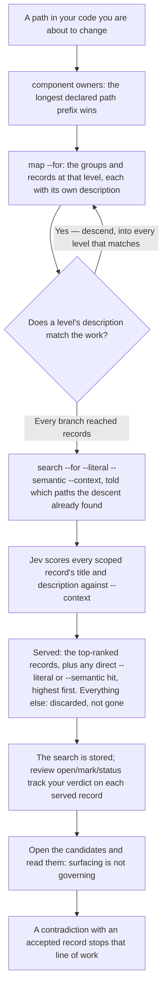
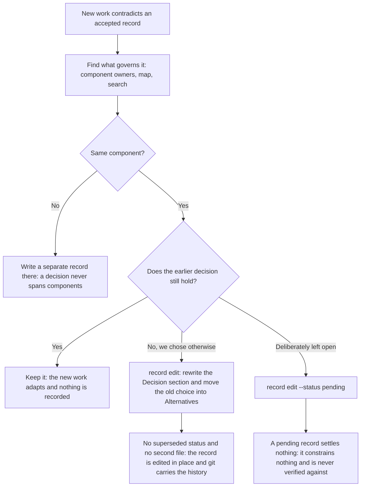
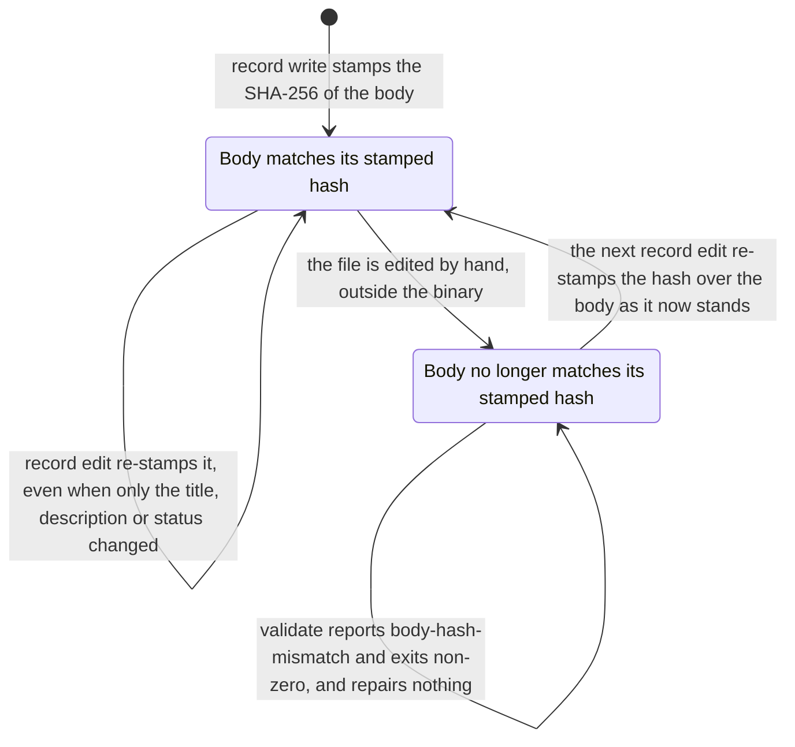
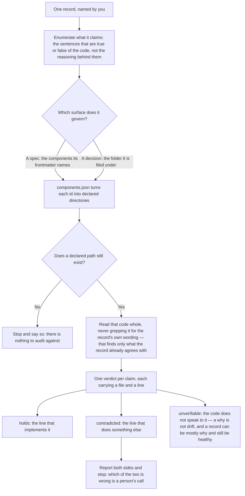
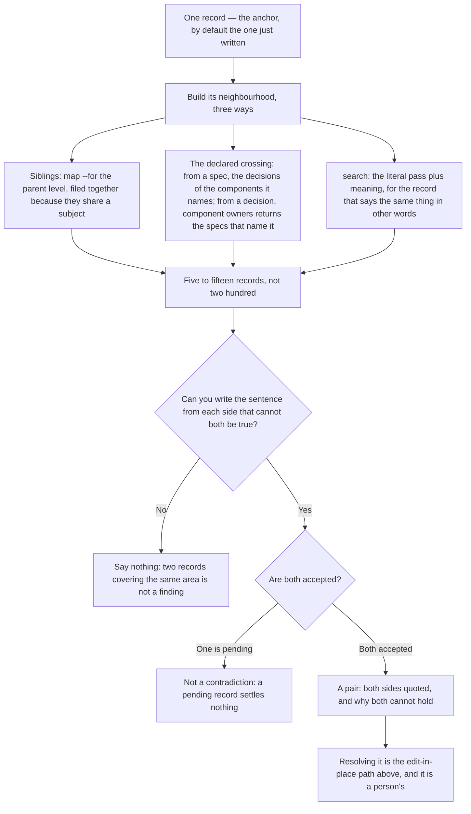

# openrecord

A project's durable records: **what was chosen and why**, and **what the system does**. A directory
layout, two kinds of document, and a CLI that reads and writes them.

It is not an agent framework. `search` is the one place a model runs: it sends every scoped record's
title and description, plus the context you give it, to a small ranking model (Jev, over OpenRouter)
that scores how well each one fits — never the record's body, and never a verdict about what governs
your work, only a ranking. `search` also requires [qmd](https://github.com/franwerner/qmd) for its
own meaning-based pass; there is no mode that runs without either. Everything else is deterministic;
everything that needs judgement is prose a person or an agent writes.

## Install

```bash
curl -fsSL https://raw.githubusercontent.com/franwerner/open-record/master/scripts/install.sh | bash
```

Installs to `~/.local/bin`. Set `INSTALL_DIR` to change that, or `VERSION=v0.1.0` to pin a release.

It also installs [qmd](https://github.com/franwerner/qmd), since `search` requires it — there is no
prompt and no way to skip it. If npm is not on the PATH, that step is skipped with a warning and you
can run it later with `openrecord qmd install`. `search` also needs `OPENROUTER_API_KEY` set, for the
ranking model it calls at query time.

With a Go toolchain:

```bash
go install github.com/franwerner/open-record/cmd/openrecord@latest
```

Or download an archive for your platform from
[Releases](https://github.com/franwerner/open-record/releases) and put the binary on your `PATH`.

## Use

```bash
# Declare a surface. The first one creates the store.
openrecord component add api --path src/api \
  --title "API" --description "The HTTP surface. Descend here if you touch endpoints."

# Find what governs the code you are about to change.
openrecord component owners src/api/handlers/user.go   # → api
openrecord map --for decisions/api                     # → its concerns, with descriptions
openrecord map --for decisions/api/security            # → subgroups and records

# Search: exact wording, meaning, and a ranking of everything in scope
# against the work you are about to do. Stored, so it can be reviewed later.
openrecord search --for decisions/api --literal "rate limit" \
  --semantic "rate limiting policy" --context "adding a per-user rate limit"

# Write. Nothing invalid ever lands: the checks run on the way in.
openrecord level add decisions/api/security
openrecord record write decisions/api/security/at-the-gateway.md \
  --title "Rate limiting at the gateway" \
  --description "Applied at the gateway, not in each handler." \
  --status accepted --body-file ./body.md

# Check, render, and hand the agent skills to your tool.
openrecord validate
openrecord diagram specs/flow/user-signup.md
openrecord skills --emit .claude/skills/
```

Every command returns JSON on stdout, because the first consumer is an agent. `diagram` is the one
exception — it emits raw Mermaid, so it can be piped.

## The store

```
.openrecord/
├── decisions/<component>/<concern>/[<subgroup>/]<record>.md
├── specs/<type>/[<subgroup>/]<capability>.md          flow | rule | lifecycle | process
└── components.json
```

Two rules generate most of that shape:

**A single-valued axis becomes a folder; a multi-valued axis becomes a property.** A decision governs
one surface, so the component is its folder. A capability crosses surfaces, so its components are a
frontmatter list — a signup that starts in the UI, passes through the API and can also be triggered
from the CLI is *one* capability, not three.

**Every level declares when to descend into it.** Each folder carries an `INDEX.md` holding only a
title and a description. It never lists what is inside: listing is generated from frontmatter, so
there is nothing to fall out of sync.

## Finding what governs a change

Three commands, in order, and only the middle one enumerates. `component owners` turns a path in your
code into the surface that governs it. `map` walks down from there a level at a time, and you steer it
by reading each level's description — descend into every one that matches the work, not the one that
matches best. `search` then scores every record still in scope — by exact wording (`--literal`), by
meaning (`--semantic`), and by a ranking model's judgement of your `--context` — in one call; tell it
what the descent already found with `--omit` and it leaves those out.


```mermaid
flowchart TD
    F["A path in your code you are about to change"] --> O["component owners: the longest declared path prefix wins"]
    O --> M["map --for: the groups and records at that level, each with its own description"]
    M --> D{"Does a level's description match the work?"}
    D --> |"Yes — descend, into every level that matches"| M
    D --> |"Every branch reached records"| S["search --for --literal --semantic --context, told which paths the descent already found"]
    S --> J1["Jev scores every scoped record's title and description against --context"]
    J1 --> R["Served: the top-ranked records, plus any direct --literal or --semantic hit, highest first. Everything else: discarded, not gone"]
    R --> ST["The search is stored; review open/mark/status track your verdict on each served record"]
    ST --> OP["Open the candidates and read them: surfacing is not governing"]
    OP --> K["A contradiction with an accepted record stops that line of work"]
```

No search proves an absence. Coverage comes from reading the descriptions on the way down, never from
a query coming back empty — which is why the descent runs first and `search` is told what it found.
[docs/cli.md](docs/cli.md) documents every command in full.

## Handling contradictions

A decision that new work contradicts is never superseded — there is no such status. The record is
edited in place: the new choice replaces the old one, the old one moves into `## Alternatives`, and
git carries the history. Leaving the question open is `pending`, which settles nothing — a pending
record constrains nothing and is never verified against.


```mermaid
flowchart TD
    W["New work contradicts an accepted record"] --> F["Find what governs it: component owners, map, search"]
    F --> C{"Same component?"}
    C --> |"No"| O["Write a separate record there: a decision never spans components"]
    C --> |"Yes"| S{"Does the earlier decision still hold?"}
    S --> |"Yes"| K["Keep it: the new work adapts and nothing is recorded"]
    S --> |"No, we chose otherwise"| E["record edit: rewrite the Decision section and move the old choice into Alternatives"]
    S --> |"Deliberately left open"| P["record edit --status pending"]
    E --> G["No superseded status and no second file: the record is edited in place and git carries the history"]
    P --> N["A pending record settles nothing: it constrains nothing and is never verified against"]
```

Every record carries a `body-hash`, the SHA-256 of its body, stamped by `record write` and re-stamped
by `record edit` on every edit — including one that only touches the title, description or status. A
file changed by hand keeps the old stamp, so `validate` reports `body-hash-mismatch` and exits
non-zero. It repairs nothing: the next `record edit` re-stamps the hash over the body as it now stands.


```mermaid
stateDiagram-v2
    state "Body matches its stamped hash" as Stamped
    state "Body no longer matches its stamped hash" as Drifted
    [*] --> Stamped: record write stamps the SHA-256 of the body
    Stamped --> Stamped: record edit re-stamps it, even when only the title, description or status changed
    Stamped --> Drifted: the file is edited by hand, outside the binary
    Drifted --> Drifted: validate reports body-hash-mismatch and exits non-zero, and repairs nothing
    Drifted --> Stamped: the next record edit re-stamps the hash over the body as it now stands
```

[docs/decision-record.md](docs/decision-record.md) explains both in full.

## Checking that a record is still true

`validate` checks that a record is well formed. It never checks that it is still *true* — that is
reading, not linting, and nothing in a record's body is machine-checkable by design. Two skills do
that reading, and they differ in what they hold the record up against: `openrecord-audit` reads it
against the code it governs, `openrecord-reconcile` against the other records it could contradict.
Neither writes, and neither resolves a contradiction on its own.

`audit` starts from one record you name, and never from a whole coordinate — a sweep nobody chose is
a list nobody reads.


```mermaid
flowchart TD
    R["One record, named by you"] --> C["Enumerate what it claims: the sentences that are true or false of the code, not the reasoning behind them"]
    C --> S{"Which surface does it govern?"}
    S --> |"A spec: the components its frontmatter names"| P["components.json turns each id into declared directories"]
    S --> |"A decision: the folder it is filed under"| P
    P --> N{"Does a declared path still exist?"}
    N --> |"No"| X["Stop and say so: there is nothing to audit against"]
    N --> |"Yes"| D["Read that code whole, never grepping it for the record's own wording — that finds only what the record already agrees with"]
    D --> V["One verdict per claim, each carrying a file and a line"]
    V --> H["holds: the line that implements it"]
    V --> T["contradicted: the line that does something else"]
    V --> U["unverifiable: the code does not speak to it — a why is not drift, and a record can be mostly why and still be healthy"]
    T --> Z["Report both sides and stop: which of the two is wrong is a person's call"]
```

`reconcile` starts from one record too, for a harder reason: comparing every record against every
other does not scale, and two hundred records are twenty thousand pairs. So it anchors — by default
on the record just written, the moment it was added without reading the two hundred already there —
and bounds the neighbourhood through what the store already declares.


```mermaid
flowchart TD
    A["One record — the anchor, by default the one just written"] --> W["Build its neighbourhood, three ways"]
    W --> S1["Siblings: map --for the parent level, filed together because they share a subject"]
    W --> S2["The declared crossing: from a spec, the decisions of the components it names; from a decision, component owners returns the specs that name it"]
    W --> S3["search: the literal pass plus meaning, for the record that says the same thing in other words"]
    S1 --> P["Five to fifteen records, not two hundred"]
    S2 --> P
    S3 --> P
    P --> Q{"Can you write the sentence from each side that cannot both be true?"}
    Q --> |"No"| G["Say nothing: two records covering the same area is not a finding"]
    Q --> |"Yes"| B{"Are both accepted?"}
    B --> |"One is pending"| K["Not a contradiction: a pending record settles nothing"]
    B --> |"Both accepted"| F["A pair: both sides quoted, and why both cannot hold"]
    F --> E["Resolving it is the edit-in-place path above, and it is a person's"]
```

The declared crossing is the one worth the cost. A spec promises what an actor observes and a
decision constrains how it is built, so the two contradict each other **without sharing vocabulary**
— neither reading the siblings nor searching the wording reaches that pair, only the declared link
does.

Both of these are asked for. The check that runs on its own is in `openrecord-consult`: having
already opened the records that govern the file you are about to change, it says whether each one is
still true of that file, with the line that shows it. That costs one more look at something already
open, and it is the only moment the check is free.

## Documentation

| | |
| --- | --- |
| [docs/README.md](docs/README.md) | The three layers, and the store at a glance. |
| [docs/decision-record.md](docs/decision-record.md) | What a decision record is and is not. |
| [docs/capability-spec.md](docs/capability-spec.md) | The same for specs, the four types, and diagrams. |
| [docs/cli.md](docs/cli.md) | Every command. |
| [docs/concerns.md](docs/concerns.md) | The catalogue: eleven concerns and their topics. |

## Semantic search and Jev

`search` requires two things beyond the binary itself, and fails outright without either — there is no
degraded mode: a separate project, [qmd](https://github.com/franwerner/qmd), indexed with a working
embedding model, for the meaning-based pass; and `OPENROUTER_API_KEY`, for the Jev model that ranks
every scoped record's title and description against the `--context` you give it. A record's body is
never sent anywhere.

```bash
openrecord qmd status     # installed, usable, and which collections this project needs
openrecord qmd install    # install or reinstall it
openrecord jev status     # is the key set, and does the endpoint answer
```

`openrecord skills --emit <dir>` emits one variant: every bundled skill describes `search` as it
actually behaves, with no flag to choose between describing a smaller tool and the real one.

## Building

```bash
go build ./cmd/openrecord
go test ./...
```
